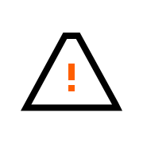

# Danger rules at [Futured](https://www.futured.app)

[](https://badge.fury.io/rb/thefuntasty_danger)

*Note: Our company name was The Funtasty before the rebranding, therefore the name `thefuntasty_danger`*

These are the rules we use for checking our pull requests by Danger optimized for mobile app development:

- Only `release/` branches can point to master.
- Branch name should have `release/`, `hotfix/`, `fix/`, `housekeep/` or `feature/` prefix.
- Title should be `JIRA-ID Some descriptive name` for `feature/` and `fix/` branches.
- Should not be work in progress `[WIP]`.
- Should not be over 500 lines.
- Commit names should start with a large letter and should not be too long.
- iOS specific:
  - Xcode build should not produce any warnings.

Examples of pretty branch names:

- `feature/JIRA-00-chat-screen`
- `fix/JIRA-00-sending-messages`
- `release/v0.0.0-0`
- `housekeep/dependencies`
- `hotfix/JIRA-00-crash-on-launch`

## Installation

We want to run Danger on CI, so the configuration here is focusing on it.

First, we need to get the GitHub API token for the bot account, which will be commeting our pull requests and set it as an environment variable.

```
export DANGER_GITHUB_API_TOKEN=XXXXX
```

Second, if we do not use other Ruby tools and gems, we need to create Gemfile for our dependencies:

```
bundle init
```

Then we add the Danger rules gem as a dependency:

```
bundle add thefuntasty_danger
```

And last if we need to install/update our rules, we only need to call:

```
bundle install
```

After the setup is finished we can simply create `Dangerfile` and import this configuration.

```
danger.import_dangerfile(gem: 'thefuntasty_danger')
```

For testing locally we can just call:

```
bundle exec danger local
```

If we need to automate this (for CI) and do not have other Ruby dependencies then this short script will install everything we need and run Danger (if of course Ruby and bundler are installed):

```
#!/usr/bin/env bash
bundle init
bundle add thefuntasty_danger
bundle install
echo "danger.import_dangerfile(gem: 'thefuntasty_danger')" > Dangerfile
bundle exec danger
```

## Deployment

For deploying to RubyGems run these commands:

```
gem build thefuntasty_danger
gem push thefuntasty_danger-X.X.X.gem
```

## Contributors

Current maintainer and main contributor is [Matěj Jirásek](https://github.com/mkj-is), <matej.jirasek@futured.app>.

## License

Project is available under the MIT license. See the [LICENSE file](LICENSE) for more information.
